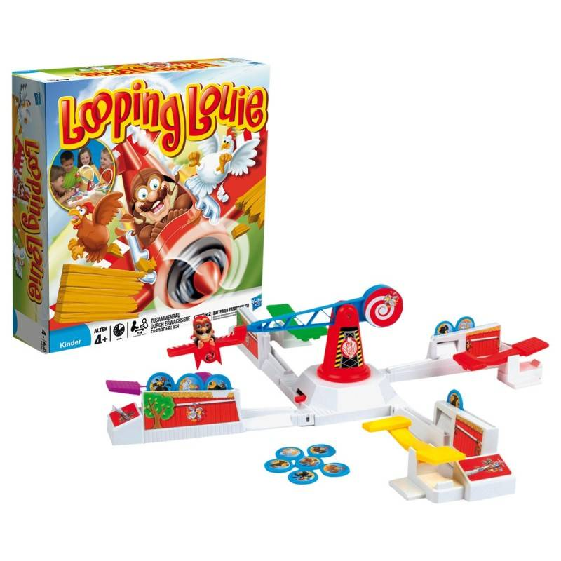

## 32-bit Beta CPU

This repository contains the source code that implements 32-bit Beta CPU in Lucid programming language. 
Simply open `beta-32-document.alp` with [Alchitry Lab](https://alchitry.com/alchitry-labs), **compile**, and **flash** it to Alchitry Au + Alchitry Io Element Board.
The Beta CPU contains a set of 200 lines of instructions that are used to run Techno Twirl.

### Details about Looping Louie

Techno Twirl is inspired by a childhood game named Looping Louie. 
Looping Louie is a tabletop board game where players compete to protect their precious tokens from the swooping attacks of Louie, the daring pilot. Louie, flying his plane in loops, attempts to steal players' tokens using his spinning plane. The last player with tokens left standing wins the game!
Players take turns activating a lever to flip Louie's plane, attempting to protect their tokens while trying to knock out opponents' tokens. With each round, the tension builds as Louie's plane swoops lower and faster, testing players' reflexes and strategic prowess.

### Details on Techno Twirl

Inspired by the fast-paced, family-friendly and exciting board game, we developed Techno Twirl which runs on Lucid Programming language. 
In place of Pilot Louie, we use lights to display the current location of Louie. 
At the start of each game, players are allocated 5 lives. As Louie loops around the board on his bright blue display, players press their respective buttons to prevent Louie from taking away their lives. In Techno Twirl, players are discouraged from spamming on the button when Louie is not at their location, we do so by implementing the rule that players will lose a live if they do press their button even though Louie is not at their location.

### Features of the game
At the start of each game, players need to hold down their buttons to secure their participation in the game and press the middle start button to populate their lives. Once all players are ready, press the middle start button again so that Louie will start making his rounds. 

After each round, Louie will start moving slightly faster. Players can also press the middle button during the game to get Louie to speed up. Once there is only one player left, the game will stop and display the colour of the player that survived the longest. In the end game interface, the game will display the number of rounds that was completed and display red.

Players can also opt to play single-player by registering only one button at the start of the game. Players can compete via Single-Player mode to see who can reach the most number of rounds with 5 lives. 

### Controls on the ALU

Ensure that **ALL** `io_dip` is switched OFF when flashing the code.

Once flashed, you may set the following to run the Beta:

1. io_dip[2][7]: toggles between manual (0) and auto mode (1)
2. io_dip[2][6]: toggles between slow (0) or faster clock (1)
3. io_dip[1][0]: toggle fast clock to slow speed
4. io_dip[1][1]: toggle fast clock to medium speed
5. io_dip[1][2]: toggle fast clock to fast speed
*ONLY TOGGLE ONE OF THE THREE POSSIBLE SPEEDS, OTHERWISE THE FAST CLOCK WILL BE TOO SLOW TO RUN THE GAME SMOOTHLY.

6. `button[0]`: Represents player 1's button.
7. `button[1]`: Represents player 2's button.
8. `button[2]`: Represents player 3's button.
9. `button[3]`: Represents player 4's button.
10. `button[4]`: Represents start/reset button.

### Reset button

If you press Alchitry Au reset button, it will reset the Beta to its original state (`PC` set to `0x80000000`)

### Additional Signals

There are 4 additional signals indicated in `io_led[2][7:4]`. This is just a status signal to indicate which clock your Beta CPU is running on.

1. `io_led[2][7]`: auto mode is ON or OFF
2. `io_led[2][6]`: `fastclock` is ON or OFF
3. pin outled C40 : Main light display 
4. pin outled_p1 C43: Button light for player 1
5. pin outled_p2 C42: Button light for player 2
6. pin outled_p3 C46: Button light for player 3
7. pin outled_p4 C45: Button light for player 4
8. `Seven Segment[0]`: Display Player 1's lives
9. `Seven Segment[1]`: Display Player 2's lives
10. `Seven Segment[2]`: Display Player 3's lives
11. `Seven Segment[3]`: Display Player 4's lives
12. `Seven Segment[4]`: Display Number of Rounds in the One place
13. `Seven Segment[5]`: Display Number of Rounds in the Ten place